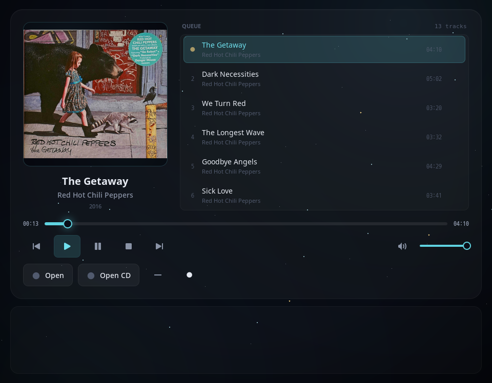

# Gozik



A simple desktop music player for Linux. It plays local audio files and audio CDs with a minimal GTK3 interface.

## Supported Formats

**Audio**

- MP3
- FLAC
- WAV
- Ogg Vorbis / Opus
- AIFF / AIF
- WMA
- M4A / AAC / ALAC
- APE, WavPack, TTA, Musepack, AC3, DTS, AMR, RealAudio, CAF, AU, VOC, DSF/DFF, and other FFmpeg-readable audio files
- Raw PCM (`.raw`, `.pcm`) — 16-bit stereo, little-endian, 44100 Hz, with size validation

**Playlists**

- M3U / M3U8

**Other Sources**

- Audio CD tracks (via CD-ROM drive)

## Build

Requires Go 1.21+, GTK3 development headers, and `ffmpeg` for broad format fallback playback.

```bash
make
```

Or directly with Go:

```bash
go build ./cmd/gozik
```

## Run

```bash
./gozik
```

You can also pass a file or playlist as an argument if the application supports it in the future.

## Controls

- **Open**: Add local audio files to the playlist
- **Open CD**: Load audio tracks from a CD-ROM drive (`/dev/sr0`)
- **Play / Pause / Stop**: Standard playback controls
- **Progress bar**: Click or drag to seek within the current track
- **Volume knob**: Adjust playback volume
- **Right-click on a track**: Remove it from the playlist

## Project Structure

```
assets/         Icons and Glade UI files
cmd/gozik/   Application entrypoint
internal/
  audio/        Audio playback engine (beep-based)
  cdrom/        CD-ROM reading (Linux)
  config/       Asset paths
  models/       Data types
  ui/           GTK3 window and controls
  utils/        Small helpers
```

## License

This project is open source. See the repository for license details.
